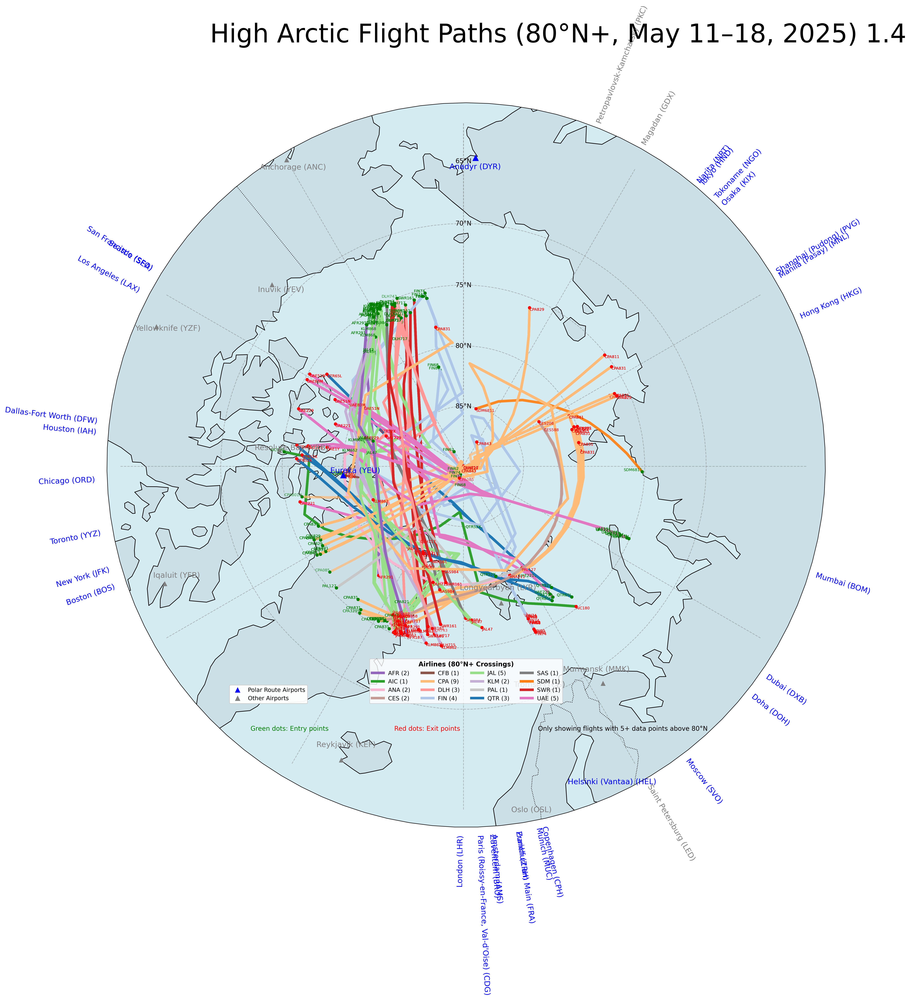

# Polar Rush

A data visualization project tracking and analyzing flight paths across the Arctic region, with special focus on flights that cross above 80°N latitude.



## Overview

Polar Rush collects flight data from the FlightRadar24 API to analyze and visualize air traffic patterns across the Arctic region. The project identifies and tracks flights that cross the high Arctic (above 80°N latitude), an area with limited coverage but increasing traffic due to the growing popularity of polar routes between major global destinations.

## Features

- Data collection from FlightRadar24 API with throttling and error handling
- Processing and enrichment of flight data with origin/destination airport information
- Sophisticated visualization of flight paths on a polar stereographic projection
- Identification of high Arctic crossings (flights that cross above 80°N)
- Airport visualization and connections to flight entry/exit points
- Color-coded airlines for easy identification

## Components

The project consists of three main Python scripts:

1. **polar_rush.py**: Collects flight data from the FlightRadar24 API for the Arctic region
2. **add_airport.py**: Enhances flight data with airport information (origin, destination)
3. **viz.py**: Creates visualizations of flight paths across the Arctic region

## Data Sources

- Flight data: FlightRadar24 API (requires API key)
- Airport data: `world-airports.csv` (comprehensive global airport database)
- Geographic data: Natural Earth (110m land features)

## Setup

### Prerequisites

- Python 3.9+
- FlightRadar24 API key (stored in .env file)
- Required Python packages (see requirements section)

### Environment Setup

1. Clone the repository
2. Create a virtual environment:
   ```
   python -m venv .venv
   source .venv/bin/activate  # On Windows: .venv\Scripts\activate
   ```
3. Install required packages:
   ```
   pip install pandas matplotlib cartopy requests python-dotenv
   ```
4. Create a `.env` file with your FlightRadar24 API key:
   ```
   FR24_API=your_api_key_here
   ```

5. Download world-airports.csv from https://ourairports.com/data/

## Usage

### Data Collection

Run the polar_rush.py script to collect flight data:

```
python polar_rush.py
```

This will generate a CSV file with flight positions (`arctic_flights_last_24h.csv`) and a summary file (`arctic_flights_summaries.csv`).

### Data Enhancement

Run the add_airport.py script to enhance flight data with airport information:

```
python add_airport.py
```

This will generate an enhanced CSV file (`arctic_flights_enhanced.csv`) with origin and destination details.

### Visualization

Run the viz.py script to create visualizations:

```
python viz.py
```

This will generate a high-resolution map of Arctic flight paths (`high_arctic_flights_map.png`).

## Analysis Insights

The visualization reveals several interesting patterns:

- Major airlines operating in the high Arctic region
- Common polar routes between continents
- Key airports serving as entry/exit points to polar routes
- Seasonal and temporal patterns in polar route usage

## License

This project is for educational and research purposes only. Use of the FlightRadar24 API is subject to their terms and conditions.

## Acknowledgments

- FlightRadar24 for providing the API
- Natural Earth for geographic data
- Matplotlib and Cartopy for visualization capabilities
- https://ourairports.com/data/ for airports reference data
